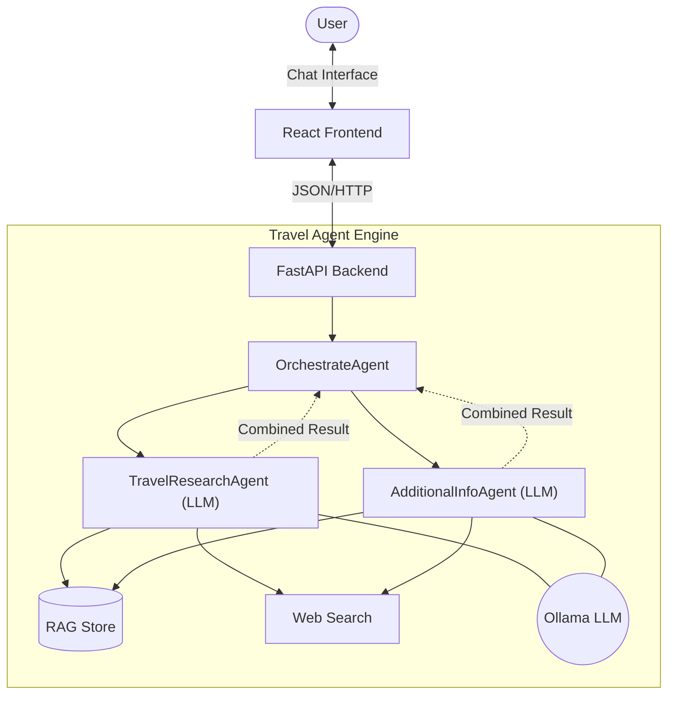

# 🌍 AI Trip Agent

An advanced, intelligent travel assistant that combines **local knowledge (RAG)** and **Web Search** to provide comprehensive travel plans and answers.

## 🚀 Key Features
*   **Hybrid Intelligence**:
    *   **RAG (Retrieval-Augmented Generation)**: Searches your local curated dataset first for high-quality, trusted info.
    *   **Web Fallback**: Uses **DuckDuckGo** to fill in gaps if local data is missing.
*   **Modern Interactive UI**: professional React/Vite frontend with a chat interface.
*   **Dual-Agent Orchestration**:
    *   `OrchestrateAgent`: High-level coordinator that manages specialized agents.
    *   `TravelResearchAgent`: Analyzes complex queries and synthesizes a full answer.
    *   `AdditionalInfoAgent`: Specialized agent for extracting specific details from RAG.
*   **API-First Design**: Built on **FastAPI**, exposing clean REST endpoints (`/health`, `/final-response`, `/additional-info`).

## 🏗️ High Level Architecture



## 🧠 AI & Agentic Concepts
This project demonstrates advanced **Agentic AI** patterns:

1.  **Retrieval-Augmented Generation (RAG)**:
    *   Instead of relying solely on the LLM's training data, we inject specific, trusted knowledge from our `dataset_json` folder.
    *   **Vector Search**: We use **Qdrant** to semantically search for relevant chunks of text based on the user's query.

2.  **Tool Use (Function Calling)**:
    *   The Agent isn't just a chatbot; it has "hands". It can efficiently determine *when* to use a tool.
    *   **Dynamic Fallback**: It intelligently tries local RAG data first, and only falls back to Web Search if the local data is insufficient.

3.  **Context Injection & Synthesis**:
    *   Data from 2 distinct sources (Vector DB and Web Search) is normalized and fed into the LLM's context window.
    *   The LLM acts as a **Reasoning Engine**, synthesizing conflicting or disparate data points into a cohesive, human-readable itinerary.

4.  **Local Inference**:
    *   Runs entirely on local hardware using **Ollama**, ensuring data privacy and zero inference costs.

5.  **Technical Guardrails (Strict Relevance)**:
    *   **Keyword Filtering**: Prevents "Data Mixing" where RAG might return high-scoring but semantically unrelated documents.
    *   **Fallback Logic**: Automatically shifts to Web Search ONLY when the local Knowledge Base fails relevance checks.

## 🤖 Agent Specifications (Multi-Agent System)

The system employs a collaborative multi-agent architecture:

### 1. `OrchestrateAgent` (The Coordinator)
*   **Role**: Primary entry point for all research requests.
*   **Primary Objective**: To trigger specialized agents in sequence and merge their intelligence.
*   **Strategy**: Executes `TravelResearchAgent` for the base narrative and `AdditionalInfoAgent` for deep-dive metadata, ensuring no detail is missed.

### 2. `TravelResearchAgent` (The Synthesis Engine)
*   **Role**: Expert Travel Researcher & Synthesis Specialist.
*   **Primary Objective**: To consolidate information from multiple sources into a comprehensive, human-readable response.
*   **Strategy**: 
    - **Pre-Processing**: Filters RAG results using a **0.5 similarity threshold** and a **Strict Relevance Guard** to ensure accuracy.
    - **Context Assembly**: Sequentially triggers RAG search and Web fallback (if RAG is insufficient) to gather all necessary travel details.
    - **Formatting**: Strictly enforces Markdown structure for the UI.

### 2. `AdditionalInfoAgent` (The Data Specialist)
*   **Role**: Targeted Metadata Extractor.
*   **Primary Objective**: To find specific "hidden" details like ticketing rules, duration, and restrictions.
*   **Strategy**:
    - **Depth Over Breadth**: Focuses on structured metadata fields (`additional Information`) within RAG documents using a **Strict Relevance Guard**.
    - **LLM Synthesis**: Uses the LLM (Ollama) to rewrite fragmented metadata into a professional, concise summary for the traveler.

## 📅 Development Timeline

1.  **Phase 1: Foundation**
    *   Setup FastAPI architecture and basic Chat UI.
    *   Implemented core RAG system with Vector Store integration.
2.  **Phase 2: External APIs**
    *   Integrated **GetYourGuide** for initial activity data.
3.  **Phase 3: Intelligence Refinement**
    *   Introduced **Multi-Agent logic** (`AdditionalInfoAgent`) for deep metadata extraction.
    *   Implemented agentic fallback strategies (RAG -> Web).
4.  **Phase 4: API & Experience Polish** (Current)
    *   Enhanced UI with framer-motion animations.
    *   Added browser-friendly `GET` endpoints for debugging and accessibility.
    *   Comprehensive design and architectural documentation.

## 🛠️ Tech Stack
*   **Backend**: Python, FastAPI, Uvicorn
*   **Frontend**: React, TypeScript, Vite, TailwindCSS
*   **AI/LLM**: Ollama (running local models like `qwen2.5`)
*   **Data**: Qdrant (Vector Store/RAG), DuckDuckGo (Web), Firecrawl (Scraping)

## 🛠️ Environment Setup
To run the full suite (including data automation), create a `.env` file in the root:
```env
FIRECRAWL_API_KEY=your_key_here
# Ollama must be running locally
```

## 🏃‍♂️ How to Run

### 1. Backend (API)
The brain of the operation.
```powershell
# In the root 'trip_agent' folder
python api.py
```
*   Runs on: `http://localhost:8000`
*   Swagger UI: `http://localhost:8000/docs`

### 2. Frontend (UI)
The user interface.
```powershell
# Open a new terminal
cd frontend
npm run dev
```
*   Runs on: `http://localhost:3000` (auto-proxies request to backend)

### 3. Data Preparation (Optional)
If you want to add new attractions to the Knowledge Base:
1.  **Scrape**: `python dataset_json/automate.py <URL>` (Requires Firecrawl Key).
2.  **Upload**: `python rag_upload.py` to re-index the Qdrant database.

## 🧪 Testing
You can test the agent in three ways:
1.  **Chat Interface**: Just type in the frontend chat box!
2.  **Browser URL**: `http://localhost:3000/api/v1/final-response?query=Venice`
3.  **Swagger UI**: Visit `http://localhost:8000/docs`.
